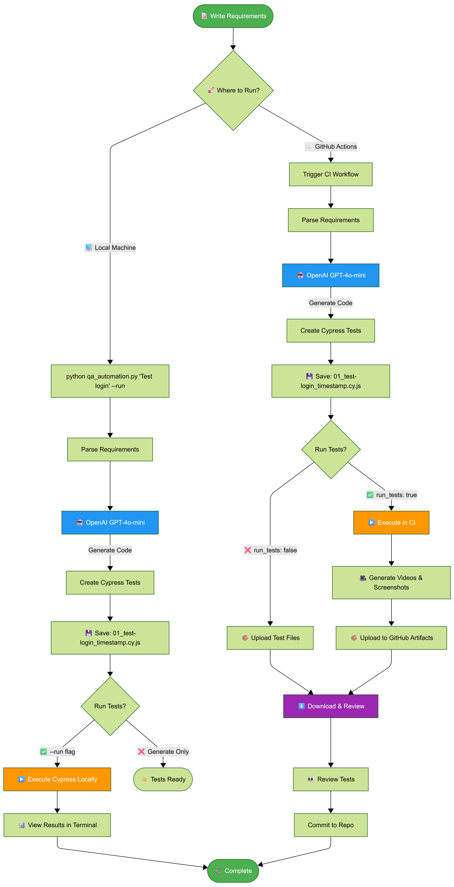

# Cypress test generation framework driven by natural-language requirements using AI

An AI-powered tool that generates Cypress end-to-end tests from natural language requirements using OpenAI's GPT-4 and LangGraph workflows.

## 📊 Visual Workflow

### Complete End-to-End Process

<p align="center">
  
</p>

This framework transforms natural language requirements into production-ready Cypress tests using AI. It works seamlessly in both **local development** and **CI/CD environments**.

---

## 🏗️ System Architecture

<p align="center">
  
</p>

---

## 🆕 cy.prompt() Integration - NEW!

This framework now supports **two test generation modes**:

### 🔹 Traditional Cypress Tests
```bash
python qa_automation.py "Test login functionality"
```
- ✅ Fast execution
- ✅ Explicit selectors
- ✅ Deterministic
- ✅ No runtime AI calls

### 🔹 Self-Healing Tests (cy.prompt)
```bash
python qa_automation.py "Test login functionality" --use-prompt
```
- ✅ Auto-adapting selectors
- ✅ Natural language steps
- ✅ Self-healing when UI changes
- ✅ Visible in Command Log

---

## Features

* 🤖 **AI-Powered**: Converts natural language requirements into working Cypress tests
* 🔄 **Dual Mode**: Traditional tests OR self-healing cy.prompt() tests
* 📚 **Document Context**: Optional vector store integration for additional context from documentation
* 🔄 **Workflow Management**: Uses LangGraph for structured test generation pipeline
* ⚡ **Auto-Run**: Optionally runs generated tests immediately with Cypress
* 📁 **Organized Output**: Generates timestamped, descriptively named test files in separate directories

## Prerequisites

* **Node.js** (v14 or higher)
* **Python** (v3.8 or higher)
* **OpenAI API Key**
* **Cypress** (v15.8.1 for cy.prompt support)

## Installation

### 1. Clone and Setup Python Environment

```bash
git clone https://github.com/aiqualitylab/cypress-natural-language-tests.git
cd cypress-natural-language-tests
python -m venv venv
source venv/bin/activate  # On Windows: venv\Scripts\activate
```

### 2. Install Python Dependencies

```bash
pip install -r requirements.txt
```

The `requirements.txt` includes:

```
langgraph
langchain-openai
langchain-community
langchain
chromadb
python-dotenv
```

### 3. Setup Environment Variables

Create a `.env` file in the project root:

```
OPENAI_API_KEY=your_openai_api_key_here
```

### 4. Initialize Cypress

```bash
npm install cypress@15.8.1 --save-dev
npx cypress open  # Initial setup
```

## Usage

### Basic Usage

Generate Cypress tests from natural language requirements:

```bash
# Traditional tests
python qa_automation.py "Test user login with valid credentials"

# Self-healing tests with cy.prompt()
python qa_automation.py "Test user login with valid credentials" --use-prompt
```

### Command Line Arguments

| Argument | Description | Default |
| --- | --- | --- |
| `requirements` | One or more test requirements (positional) | Required |
| `--out` | Output directory for generated specs | `cypress/e2e` |
| `--use-prompt` | Generate self-healing tests with cy.prompt() | `false` |
| `--run` | Run Cypress tests after generation | `false` |
| `--docs` | Directory with additional context documents | `None` |

---

## 📖 Examples

### 1. Basic Test Generation (Traditional)

```bash
python qa_automation.py "Test login page"
```

**Output**: `cypress/e2e/generated/01_test-login-page_20241223_100000.cy.js`

### 2. Self-Healing Test with cy.prompt()

```bash
python qa_automation.py "Test login page" --use-prompt
```

**Output**: `cypress/e2e/prompt-powered/01_test-login-page_20241223_100000.cy.js`

### 3. Multiple Requirements

```bash
python qa_automation.py \
  "Test successful login with valid credentials" \
  "Test login failure with invalid password" \
  "Test login form validation for empty fields" \
  --use-prompt
```

### 4. With Documentation Context

```bash
python qa_automation.py \
  "Test the checkout process" \
  --docs ./api-docs \
  --use-prompt
```

### 5. Generate and Run Tests

```bash
python qa_automation.py \
  "Test user profile update" \
  --use-prompt \
  --run
```

---

## 📁 Output Structure

Tests are now organized by type:

```
cypress/e2e/
├── generated/              # Traditional Cypress tests
│   ├── 01_test-login_20241223_100000.cy.js
│   └── 02_test-signup_20241223_100001.cy.js
└── prompt-powered/         # cy.prompt() self-healing tests
    ├── 01_test-checkout_20241223_100000.cy.js
    └── 02_test-cart_20241223_100001.cy.js
```

---

## 🔄 How It Works

### Option 1: Local Development

<p align="center">
  
</p>

### Option 2: CI/CD Pipeline

<p align="center">
  
</p>

---

## 📊 Test Comparison

### Traditional Cypress Test
```javascript
// cypress/e2e/generated/01_test-login_*.cy.js
describe('User Login', () => {
  it('should login successfully', () => {
    cy.visit('https://the-internet.herokuapp.com/login');
    cy.get('#username').type('tomsmith');
    cy.get('#password').type('SuperSecretPassword!');
    cy.get('button[type="submit"]').click();
    cy.get('.flash.success').should('contain', 'You logged into a secure area!');
  });
});
```

### cy.prompt() Self-Healing Test
```javascript
// cypress/e2e/prompt-powered/01_test-login_*.cy.js
describe('User Login', () => {
  it('should login successfully', () => {
    cy.prompt([
      'Visit the login page at https://the-internet.herokuapp.com/login',
      'Type "tomsmith" in the username field',
      'Type "SuperSecretPassword!" in the password field',
      'Click the login button',
      'Verify success message appears'
    ]);
    
    // Critical assertion
    cy.url().should('include', '/secure');
  });
});
```

---

## 🎯 When to Use Each Mode

| Scenario | Use This |
|----------|----------|
| Stable application | Traditional |
| Active development | cy.prompt() |
| CI/CD pipeline | Traditional |
| Exploratory testing | cy.prompt() |
| Regression suite | Traditional |
| Rapid prototyping | cy.prompt() |

---

## Configuration

### Cypress Configuration

The `cypress.config.js` enables cy.prompt():

```javascript
module.exports = defineConfig({
  e2e: {
    experimentalCypressPrompt: true,  // Enable cy.prompt()
    baseUrl: 'https://the-internet.herokuapp.com',
  }
});
```

### Customizing the Base URL

Edit the prompt templates in `qa_automation.py`:

```python
- Use `cy.visit('https://your-app.com')` as the base URL.
```

### Adjusting LLM Settings

Modify the LLM configuration in `qa_automation.py`:

```python
llm = ChatOpenAI(
    model="gpt-4o-mini",  # or "gpt-4", "gpt-3.5-turbo"
    temperature=0  # 0 for deterministic, higher for creativity
)
```

---

## 🎬 Running Tests

### Run All Tests
```bash
npm test
```

### Run Only cy.prompt() Tests
```bash
npm run cypress:run -- --spec "cypress/e2e/prompt-powered/**/*.cy.js"
```

### Run Only Traditional Tests
```bash
npm run cypress:run -- --spec "cypress/e2e/generated/**/*.cy.js"
```

### Open Cypress UI
```bash
npx cypress open
```

---

## File Naming Convention

Generated files follow this pattern:

```
{sequence}_{slugified-requirement}_{timestamp}.cy.js
```

Example: `01_test-user-login_20241223_100000.cy.js`

---

## Vector Store Integration

When using `--docs`, the tool:

1. Indexes all documents in the specified directory
2. Creates/updates a Chroma vector store in `./vector_store`
3. Uses document context to improve test generation accuracy

**Supported document formats**: `.txt`, `.md`, `.json`, `.js`, `.html`, etc.

---

## Workflow Architecture

The tool uses LangGraph to orchestrate the following steps:

1. **ParseCLI** - Parse command line arguments
2. **LoadContext** - Index documentation (if provided)
3. **GenerateTests** - Create Cypress tests using AI (traditional or cy.prompt)
4. **RunCypress** - Execute tests (if requested)

---

## 🎓 Command Reference

| Command | Description |
|---------|-------------|
| `python qa_automation.py "Test X"` | Generate traditional test |
| `python qa_automation.py "Test X" --use-prompt` | Generate self-healing test |
| `python qa_automation.py "Test X" --run` | Generate and run |
| `python qa_automation.py "Test X" --docs ./docs` | Use documentation context |
| `python qa_automation.py "Test X" --use-prompt --run` | Generate cy.prompt test and run |

---

## GitHub Copilot Integration

This repository includes GitHub Copilot instructions and skills to help you work more efficiently with AI assistance.

### Available Copilot Skills

- **Cypress AI Test Generation**: Specialized knowledge for working with the test generation pipeline
- **LangGraph Workflow Development**: Comprehensive guide for building and debugging workflows

---

## Contributing

Contributions are welcome! Please feel free to submit a Pull Request.

---

## License

MIT License

---

## Related Projects

Check out more AI-powered testing projects at [@aiqualitylab](https://github.com/aiqualitylab)

---

## About

This project generates Cypress E2E tests automatically from natural language requirements using OpenAI GPT, LangChain, and LangGraph. Now with cy.prompt() support for self-healing test capabilities!

**Author**: [@aiqualitylab](https://github.com/aiqualitylab)  
**Medium**: [AQE Publication](https://medium.com/ai-in-quality-assurance) / [Let's Automate Medium](https://aiqualityengineer.com/)

---

## 🆕 What's New in v2.0

- ✅ **cy.prompt() Integration**: Self-healing test support
- ✅ **Dual Mode Generation**: Choose traditional or cy.prompt tests
- ✅ **Organized Output**: Separate folders for different test types
- ✅ **Simplified Code**: Clean, maintainable implementation
- ✅ **Enhanced CLI**: New `--use-prompt` flag

---

🎁 **And this is just the beginning!** I have tons of awesome upgrades planned that will take this framework to the next level.

Since I'm building this solo, new features will roll out in phases — but I promise, **I won't disappoint my followers!** 💪

⭐ **Star** and 🍴 **Fork** this repo to stay updated!

Follow my Medium profile for feature announcements, tutorials, and behind-the-scenes updates: [Let's Automate Medium](https://aiqualityengineer.com/) / [AQE Publication](https://medium.com/ai-in-quality-assurance)

**Happy Testing!** 🎉
