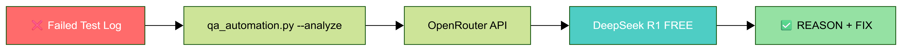
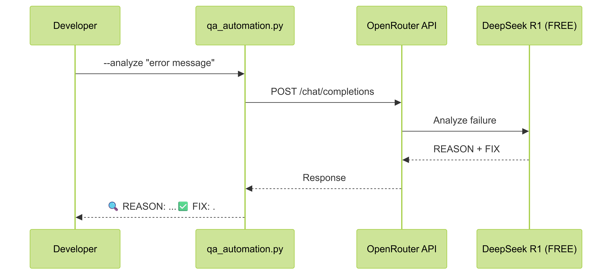

# AI-Powered Cypress Test Generator with LangGraph and Vector Store

Generate Cypress tests from plain English using AI, LangGraph workflows, and pattern learning.

## Workflow Overview

<p align="center">
  
</p>

Supports local development and CI/CD pipelines.

---

## Architecture

<p align="center">
  
</p>

---

## New in v3.0

### LangGraph Workflow

<p align="center">
  
</p>

Five workflow steps:
1. Initialize Vector Store - Create pattern database
2. Fetch Test Data - Pull HTML and extract selectors  
3. Search Similar Patterns - Query past test patterns
4. Generate Tests - Build test with AI and patterns
5. Run Tests - Execute via Cypress (optional)

### Pattern Learning

- Saves test patterns to vector database
- Finds similar patterns from history
- Applies past patterns during generation
- Builds pattern library over time

---

## Example Flow

### Initial Test
```bash
python qa_automation.py "Test login" --url https://the-internet.herokuapp.com/login
```
Steps:
1. Create vector store
2. Fetch page HTML
3. No patterns available
4. Generate fresh test
5. Save pattern

### Using Patterns
```bash
python qa_automation.py "Test user authentication" --url https://the-internet.herokuapp.com/login
```
Steps:
1. Load vector store
2. Fetch page HTML
3. Find matching patterns
4. Generate test with pattern context
5. Save new pattern

---

## Development Flow

<p align="center">
  
</p>

---

## Failure Analysis

<p align="center">
  
</p>

```bash
# Direct analysis
python qa_automation.py --analyze "CypressError: Element not found"

# From log file
python qa_automation.py --analyze -f error.log
```

<p align="center">
  
</p>

---

## CI/CD Integration

<p align="center">
  
</p>

---

## Capabilities

- LangGraph workflow engine
- Vector-based pattern storage
- Semantic pattern matching
- Natural language to test code
- URL-based test generation
- AI-powered failure diagnosis
- Traditional and cy.prompt() modes
- Pattern library management

---

## Setup

```bash
git clone https://github.com/aiqualitylab/cypress-natural-language-tests.git
cd cypress-natural-language-tests

pip install -r requirements.txt

echo "OPENAI_API_KEY=sk-your-key" > .env
echo "OPENROUTER_API_KEY=sk-your-key" >> .env

npm install cypress@15.8.1 --save-dev
```

---

## Commands

### Basic Generation
```bash
python qa_automation.py "Test login" --url https://the-internet.herokuapp.com/login
```

### cy.prompt() Mode
```bash
python qa_automation.py "Test login" --url https://the-internet.herokuapp.com/login --use-prompt
```

### Generate and Execute
```bash
python qa_automation.py "Test login" --url https://the-internet.herokuapp.com/login --run
```

### View Patterns
```bash
python qa_automation.py --list-patterns
```

### Analyze Errors
```bash
python qa_automation.py --analyze "CypressError: Element not found"
```

---

## Directory Structure

```
cypress/
├── e2e/
│   ├── generated/              # Standard tests
│   └── prompt-powered/         # cy.prompt() tests
└── fixtures/
    └── url_test_data.json

vector_db/                       # Pattern storage
└── chroma.sqlite3

prompts/
├── html_analysis.txt
├── failure_analysis.txt
├── test_generation_traditional.txt
└── test_generation_prompt_powered.txt
```

---

## File Naming

Pattern:
```
{sequence}_{slugified-requirement}_{timestamp}.cy.js
```

Examples:
```
01_test-login_20250103_142530.cy.js
02_test-signup_20250103_142545.cy.js
```

Components:
- sequence: 01, 02, 03...
- requirement: URL-safe requirement text
- timestamp: YYYYMMDD_HHMMSS
- .cy.js: Cypress file extension

---

## Releases

**v3.0** - LangGraph workflows, vector pattern learning  
**v2.2** - Dynamic test generation  
**v2.1** - AI failure analyzer  
**v2.0** - cy.prompt() support

---

**Author**: [@aiqualitylab](https://github.com/aiqualitylab)  
**Medium**: [AQE Publication](https://medium.com/ai-in-quality-assurance)